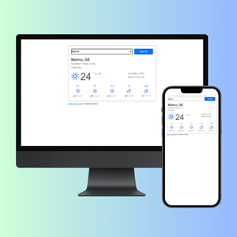

# ⛅ React Weather App

Live Demo → https://online-weather-react.netlify.app/

A single‑page React weather app that shows current conditions and a multi‑day forecast in seconds. Type a city, hit Enter – you get temperature, humidity, wind, weather icons, and daily highs & lows, all in a clean responsive layout.

## Why I built it

I wanted a lightweight, client‑only weather dashboard: no backend, just React + a public API. It’s a good exercise in handling async data, conditional rendering, and error states (city not found, network issues) while keeping the UI polished and fast.

## Key Features

-  Instant lookup. Current weather + forecast returned on one screen.
-  Unit toggle. Switch between °C and °F.
-  Forecast cards. Daily highs/lows with weather icons.
-  Responsive by design. Bootstrap grid + custom CSS; quick load times.
-  Pure front‑end. React + Axios over HTTPS, deployed on Netlify.

## Tech Stack

-  **UI:** React 18 with Hooks for state; Bootstrap 5 utilities for layout
-  **Data:** OpenWeather (Current & Forecast endpoints)
-  **HTTP:** Axios – small, promise‑based, straightforward error handling
-  **Dev:** Create React App scaffold, ESLint + Prettier for code quality
-  **Deploy:** Netlify CI/CD on every push to `main`

## How it Works

1. On load (or submit), the app requests current weather for the typed city.
2. After a successful response, a second call fetches the multi‑day forecast.
3. Components (`Weather`, `Forecast`, etc.) render the data in compact cards.
4. Error paths (empty input / city not found / network error) trigger a modal.

## What I learned

-  Managing multiple async calls and keeping state in sync with `useState` + `useEffect`.
-  Handling edge cases (invalid city, API errors) without breaking the UI.
-  Setting up a smooth Netlify deploy pipeline with environment variables for API keys.
